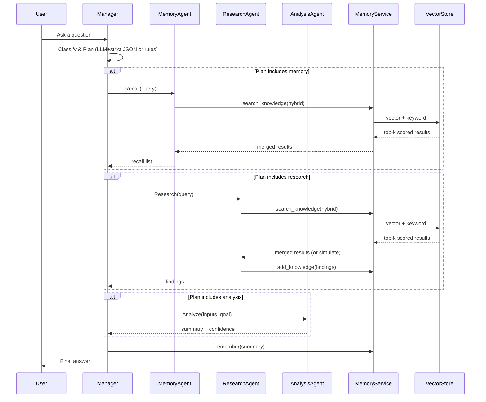

# Simple Multi-Agent Chat System

A minimal multi-agent system with a Manager coordinating Research, Analysis, and Memory agents. Includes a structured memory layer with hybrid (keyword + vector) search, deterministic decision-making, and traceable logs.

## Architecture

### Components at a glance

```mermaid
flowchart LR
    U[User] -->|Question| M((Coordinator / Manager))
    subgraph Agents
      RA[ResearchAgent]
      AA[AnalysisAgent]
      MA[MemoryAgent]
    end

    M -->|Plan & Orchestrate| RA
    M -->|Plan & Orchestrate| AA
    M -->|Recall & Store| MA

    subgraph Memory Layer
      MS[MemoryService\n- Conversation Memory\n- Knowledge Base\n- Agent State]
      VS[InMemoryVectorStore\n(Bag-of-Words + Cosine)]
    end

    MA -->|add/recall| MS
    RA -->|write knowledge| MS
    RA -.->|search (hybrid)| VS
    MS -.indexes.-> VS

    AA -->|uses outputs| M
    RA -->|findings| M
    MA -->|recall| M
    M -->|Final Answer| U
```

Rendered images (for platforms without Mermaid support):

- Component: [SVG](docs/architecture_component.svg) | [PNG](docs/architecture_component.png)
- Sequence: [SVG](docs/architecture_sequence.svg) | [PNG](docs/architecture_sequence.png)

Key responsibilities:
- Coordinator (Manager):
  - Classifies questions and plans the agent sequence (memory → research → analysis as needed).
  - Orchestrates agents, merges results, logs trace events, and stores final summaries.
- ResearchAgent:
  - Prefers memory hits (to avoid redundant work); otherwise simulates retrieval and persists findings.
- AnalysisAgent:
  - Summarizes/compares inputs with a simple coverage-based confidence score.
- MemoryAgent:
  - Adds and recalls knowledge records via the MemoryService hybrid search.
- Memory Layer:
  - Conversation memory, knowledge base, and agent state history.
  - In-memory vector store using bag-of-words vectors and cosine similarity; hybrid with keyword search.

### Sequence flow (happy path)



Rendered images (for platforms without Mermaid support):

- Sequence: [SVG](docs/architecture_sequence.svg) | [PNG](docs/architecture_sequence.png)

Sequence explained:
1) Manager classifies the task (Azure LLM plan with strict JSON parsing when available; falls back to rules otherwise).
2) If the plan starts with memory, Manager asks MemoryAgent to recall; MemoryService performs hybrid retrieval (vector + keyword) and returns merged top-k.
3) If research is needed, ResearchAgent either uses memory hits or simulates findings, persists them to the knowledge base, and returns the result.
4) If analysis is needed, AnalysisAgent summarizes/compares the collected inputs and returns a conclusion with confidence.
5) Manager synthesizes the final answer, stores a summary back into memory, and responds to the user.

## Requirements

- Python 3.11+

## Run

- Batch mode: execute five required scenarios and save outputs to `outputs/`:

```powershell
# Create venv (if not present), activate, and install deps
python -m venv .venv
.\.venv\Scripts\Activate.ps1
python -m pip install -U pip
python -m pip install -r requirements.txt

# Run (Azure disabled)
python app.py
```

- Single-turn mode:

```powershell
python app.py --prompt "What are the main types of neural networks?"
```

- Interactive REPL mode:

```powershell
python app.py --interactive
```

Outputs will appear in `outputs/` as:
- simple_query.txt
- complex_query.txt
- memory_test.txt
- multi_step.txt
- collaborative.txt

## Tests (smoke)

```powershell
.\.venv\Scripts\python.exe -m pytest -q
```

## Memory and Retrieval

- Knowledge records include: topic, content, source, agent, timestamp, confidence, tags.
- Hybrid search combines vector similarity and keyword overlap with deduping by best score.
- Prior memory usage is visible in the logs and reduces duplicate work.

## Optional LLM Integration (Azure OpenAI)

This project is LLM-optional. If you enable Azure OpenAI, wire it in the `Coordinator.classify()` and/or to rewrite/summarize final answers. Provide environment variables and a graceful fallback to the rule-based classifier.

Environment variables (.env or shell):
- AZURE_OPENAI_ENDPOINT
- AZURE_OPENAI_API_KEY
- AZURE_OPENAI_DEPLOYMENT
- AZURE_OPENAI_API_VERSION (e.g., 2024-12-01-preview)
- USE_AZURE_OPENAI=1 to enable
- AZURE_OPENAI_TIMEOUT (seconds, default 2)

Run with Azure enabled:
```powershell
$env:USE_AZURE_OPENAI='1'; $env:AZURE_OPENAI_TIMEOUT='1.5'; \
  .\\.venv\\Scripts\\python.exe app.py
```

## Containerization

```powershell
# Build
docker build -t multi-agent:local .
# Run
docker run --rm -it -v ${PWD}\outputs:/app/outputs multi-agent:local
```

## Notes

- Tracing is printed to stdout with compact dictionaries (prefix: manager.plan, research.out, analysis.out).
- The vector store is in-memory for simplicity; replace with FAISS/Chroma via the same interface if desired.
 - .env is ignored by git (.gitignore); don’t commit secrets.
